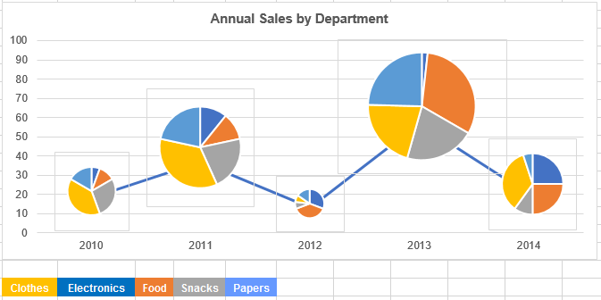
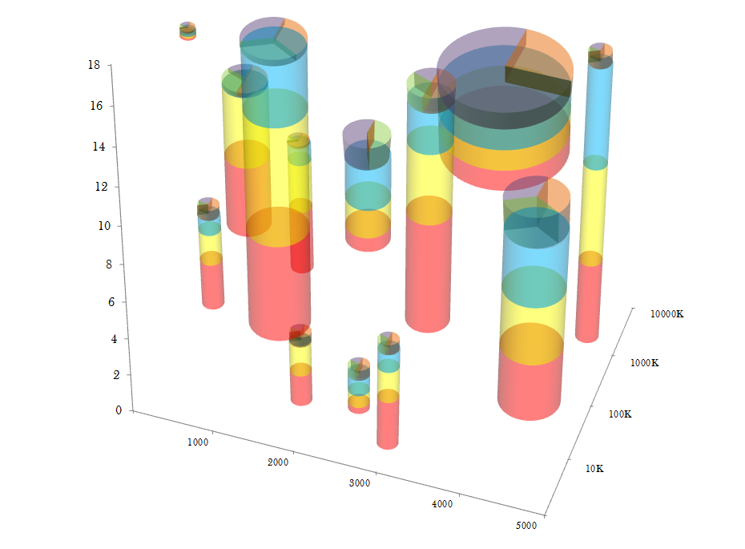
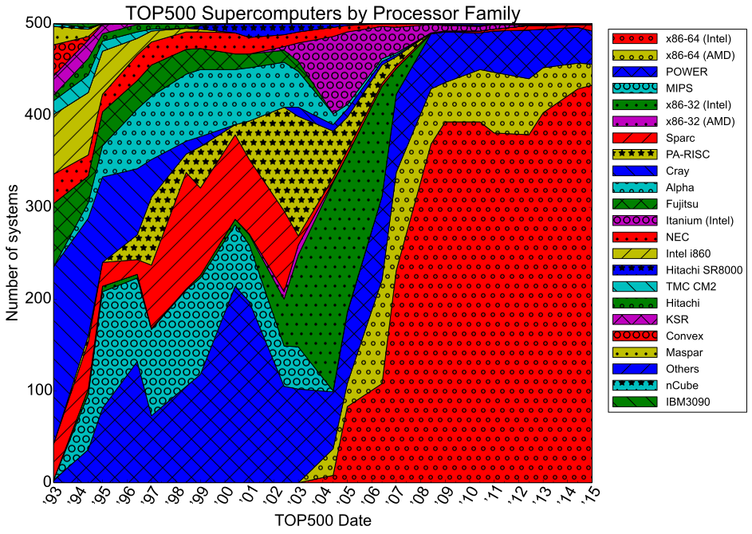
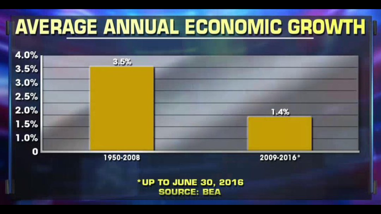

Note: (2019/04/11) A few weeks ago, the ISU Graphics group had a group presentation including the worst graphics we all could find. I've decided to keep a list of my own, many of which were stolen from various places around the web, including [/r/dataisbeautiful](https://reddit.com/r/dataisbeautiful) and  [/r/dataisugly](https://reddit.com/r/dataisugly). 

1. The line graph of pie charts of varying size.    
    
source: [Stackoverflow](https://stats.stackexchange.com/questions/268612/name-of-combined-pie-chart-and-line-graph?rq=1)

2. A 3D stacked scatter-pie-column chart.     
    
source: [EagerPies](http://eagerpies.com/better-than-minard/)

3. A stacked area chart with double-encoding... colors and textures, in enough combinations to make your eyes bleed.    
    
source: [Wikimedia Processor families in Top500 Supercomputers](https://commons.wikimedia.org/wiki/File:Processor_families_in_TOP500_supercomputers.svg)

4. A map of pet ownership in Europe    
    
source: [The /r/CrappyDesign subreddit](https://www.reddit.com/r/CrappyDesign/comments/ast3q6/this_map_about_pet_repartition_in_europe/)

5. Time series via pie chart    
I agree with the [reddit comments here](https://www.reddit.com/r/shittyaskscience/comments/5zbu14/how_much_marijuana_must_be_made_to_give_to_128_of/)... 100% of people making this chart had to be stoned.     
    
source: [The /r/shittyaskscience subreddit](https://www.reddit.com/r/shittyaskscience/comments/5zbu14/how_much_marijuana_must_be_made_to_give_to_128_of/)

6. Average annual economic growth    
    
source: https://analythical.com/blog/fox-chart-fail

7. Why map projections matter (via The West Wing)    
<iframe width="508" height="382" src="https://www.youtube.com/embed/eLqC3FNNOaI" frameborder="0" allow="accelerometer; autoplay; encrypted-media; gyroscope; picture-in-picture" allowfullscreen></iframe>

8. Snowfall in Des Moines
`r htmltools::HTML("")`    
With a remade version that doesn't have dual axes:    
`r htmltools::HTML("")`    

9. Pie charts in a map    
If you're thinking about combining a pie chart with anything other than a pie... rethink.    
    
source: https://www.nrcs.usda.gov/Internet/NRCS_RCA/maps/m14449landuse_pies.png

## Other Lists of Ugly Charts

- Nathan Yau: https://flowingdata.com/category/visualization/ugly-visualization/
- Karl Broman: https://www.biostat.wisc.edu/~kbroman/topten_worstgraphs/
