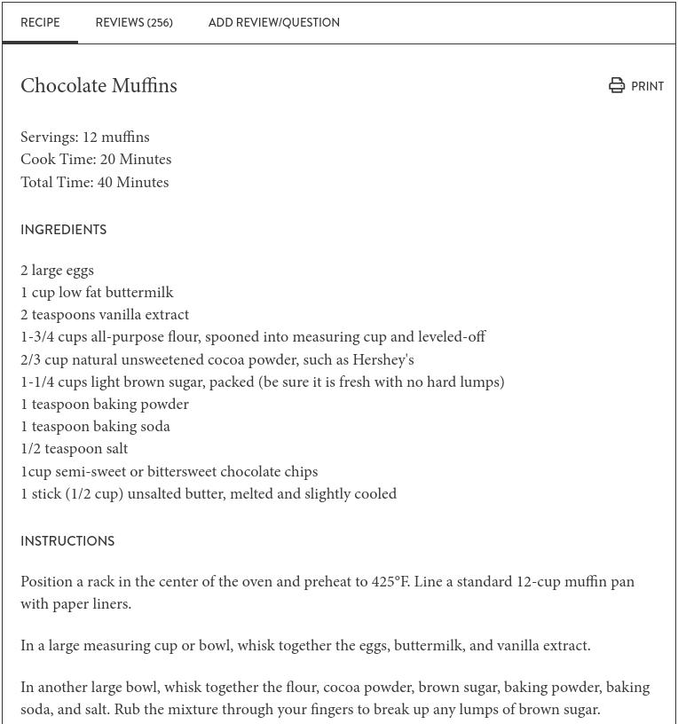

# What is Open Source Software?

## What is Source code?

Source Code | Software
----------- |  --------
 | 

### Software

That is, the source code is the directions the programmer gives the computer. It defines the way the program responds given any set of inputs. If you have the source code, you can (generally) make the program run as intended. If you only have the end result (the compiled software, which is readable by the computer and only by the computer) you basically have just the end result - you can use the software but you can't reproduce it, you don't know how it functions, and you don't know what's in it. 

If you're worried about allergens, or food safety, you might feel better baking your own muffin, right? You know exactly the conditions that go into it, what happened in the oven, etc. If you buy the muffin from a bakery, you don't have that same assurance, even if you have the ingredient list, because there could be cross-contamination, or they could have modified the recipe a bit to account for being out of something. You just don't know.

### The problem with muffins

When we create a new muffin recipe, the part that makes the new muffin unique and different could be in the ingredients, the cooking technique, or both. I could provide you the list of ingredients, like you would get in a restaurant (without any proportions), but that would only partially help you recreate the muffin. I could provide you a list of the techniques I used, and why they integrate together, but without the precise measurements and the list of ingredients, that probably won't get you  very far either. I could even add some progress pictures:

In the same way it's not particularly useful to just work off of the publication announcing the method - this is akin to having the list of techniques and steps to muffin assembly, but not having the measurements for each of the ingredients. We need the written recipe in order to recreate the muffin (though the progress pictures are very helpful -- just like having documentation along with the code).

By this analogy, the perfect combination for documenting a computational method is

1. Method description (conceptual) - from the research paper/presentation
2. Source code
3. Source code documentation
4. Written instructions for installation and use

## So what do we mean by open source?

In its most basic form, open source means that you can look at the source code. It doesn't mean that the software is free, that you can modify it, or that you can run it without permission. It just means you can see the source code.

However, most open source code is also free to use and/or modify (though some programs are only free in one sense or the other). The distinction here is often stated as "free as in speech" and "free as in beer". What this means is that under most open source software, you not only can see the source code, you can use the program for free ("free as in beer"), and you can modify the program and/or use it for what you'd like to use it for ("free as in speech") so long as you adhere to the license conditions. 

Most free and open-source software, FOSS, (or free, libre, open-source software, FLOSS), comes with a license which explicitly specifies what you can do with the software once you've got it. So in addition to providing the source code, in many cases you can modify that code as well. Usually licenses specify how you have to provide credit to the original creators, and whether or not you can use modifications in commercial software. There are usually very few restrictions on the use of code in non-commercial applications, and if you want to use code commercially, you can get a separate license for commercial purposes.

## Why is this important?

Open-source software is essential for scientific progress. It is efficient (in that collaborators and competitors don't have to reinvent the wheel), but more importantly, it allows research results to be reproduced, and this is a fundamental part of science: reproducing results reported elsewhere, and incremental improvements on previous research. Open source software allows us to make these incremental improvements, subject to license restrictions.

In forensics, this is a critical piece of ensuring that the infrastructure of the system is accessible: closed-source software is often not made available to the defense (or prosecution) in court, which allows computational errors, software bugs, and poorly developed methods to go undiscovered during the legal proceedings. Open-source, code, however, provides benefits to the prosecution and the defense: the prosecution can use the open code to establish that the methodology used in the process is well founded, and the defense can access the code to determine if there are any problems or unexpected behavior.

Currently, it is rare for courts to allow source code to be subpoenaed and examined by the defense, but this is a matter of fundamental fairness. If we return to the muffin analogy, allowing the owner of the restaurant and the server to be cross examined (corresponding to the software company CEO and the examiner using the software), we don't get the information we might need to determine if the muffin is safe to eat. We would get that information by talking to the baker and by examining the recipe - that is, we would need to talk to the software engineer/developer and look at the source code. It's not a perfect analogy, but it's at least close.

## So why don't people release their code?

1. It's extra work    
Making sure your code is functional enough to release is certainly slightly more work, but it's work that is beneficial to you (when you go back to reuse the code) as well as to anyone who is reading your method. The only thing that unambiguously describes a program is the source code - the paper is not usually sufficient to unambiguously recreate the program. But if it's that much extra work, go ahead and release the code as-is: There are licenses out there intended to fully absolve you from the consequences of your own code, such as the Community Research and Academic Programming License (CRAPL) http://matt.might.net/articles/crapl/

2. It gives my competitors an advantage    
Yes, but it also means that you turn your competitors into collaborators. If they improve your code, that's one less set of hurdles you have to overcome to continue developing the method!

3. There's no reward for doing it professionally    
Many journals now require some form of code/results reproducibility, and this may include sharing both your code and your source data. 

4. I work for the government or a private company and I'm not allowed to release my code.    
Microsoft and Google are both huge supporters of open-source. Smaller entities, too, will often maintain open-source code because the bug-finding benefits of having more users outweighs the loss from making the code available. In many cases, companies may do this selectively, by open-sourcing basic libraries and keeping the user-interface closed-source. The US Government (and especially national labs and other research focused organizations) is a huge contributor to open-source software: Even [NIST has a github account with more than 750 projects released thus far](https://github.com/usnistgov) ([Los Alamos](https://github.com/lanl), [Pacific Northwest](https://github.com/pnnl), [Oak Ridge](https://github.com/ornl), [DOJ](https://github.com/usdoj), [US Naval Research Lab](https://github.com/USNavalResearchLaboratory), [UK Ministry of Justice](https://github.com/ministryofjustice), [Canada Department of Justice](https://github.com/justicecanada)). 

US Government employees' work during their employment is technically part of the public domain (see [US CBP open source policy](https://github.com/US-CBP/open-source-policy/blob/master/practice.md))

https://arstechnica.com/science/2012/02/science-code-should-be-open-source-according-to-editorial/
